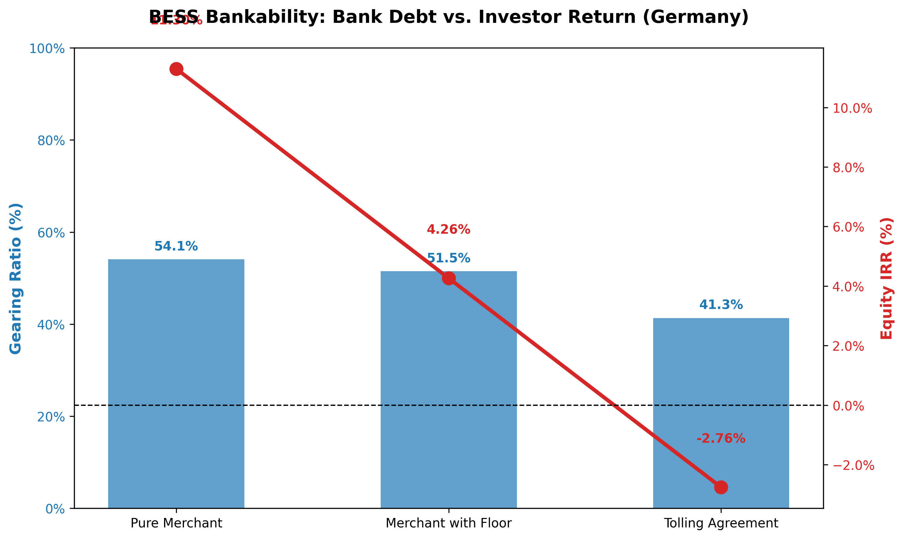

# 📊 BESS Financial Risk & Bankability Modeling (Germany)

[](https://bess-financial-risk-modeling-u47jq2enuvruqqlvymdfuk.streamlit.app/)
[](https://www.python.org/)
[](https://pandas.pydata.org/)
[](https://docs.pytest.org/)
[](https://opensource.org/licenses/MIT)

A production-grade Python and Streamlit tool designed to evaluate the project finance bankability, Debt Service Coverage Ratio (DSCR), and Equity Internal Rate of Return (IRR) of Battery Energy Storage Systems (BESS) under different offtake strategies in the German energy market.


> *Figure: Comparison of Bank Gearing Ratio vs. Investor Equity IRR across Pure Merchant, Merchant with Floor, and Tolling Agreement strategies.*

---

## 📌 Executive Summary
Securing non-recourse project finance for BESS projects requires carefully balancing commercial risk appetite with strict banking constraints. This project models a cash flow waterfall for a reference **10 MW / 20 MWh BESS** over a 15-year technical lifetime in Germany. 

The application evaluates how different revenue offtake structures impact the capital stack, debt sizing capacity, and ultimate equity returns.

### 📋 Performance & Bankability Summary Matrix

| Strategy | Target DSCR | Annual Revenue (€) | CFADS (€) | Max Debt Service (€) | Debt Capacity (€) | Equity Required (€) | Gearing Ratio (%) | Equity IRR (%) | Payback (Years) |
| :--- | :---: | :---: | :---: | :---: | :---: | :---: | :---: | :---: | :---: |
| **Pure Merchant** | 1.75x | €1,200,000 | €735,000 | €420,000 | €3,243,129 | €2,756,871 | **54.1%** | **11.30%** | 9 Years |
| **Merchant with Floor** | 1.40x | €950,000 | €560,000 | €400,000 | €3,088,694 | €2,911,306 | **51.5%** | **4.26%** | 13 Years |
| **Tolling Agreement** | 1.20x | €700,000 | €385,000 | €320,833 | €2,477,390 | €3,522,610 | **41.3%** | **-2.76%** | >15 (Never) |

### 🔑 Key Findings & Insights
1. **The Cost of Certainty (Tolling Risk):** While a **Tolling Agreement** offers highly predictable cash flows allowing a lower target DSCR (1.20x), the severely capped revenue results in a **negative Equity IRR (-2.76%)** and requires the heaviest upfront equity injection (€3.52M).
2. **The Merchant Premium:** The **Pure Merchant** strategy exposes the asset to market volatility (demanding a higher DSCR of 1.75x and limiting bank debt to 54.1%), but its superior revenue upside delivers a healthy **11.30% Equity IRR** and a rapid 9-year payback period.
3. **The Balance:** A **Merchant with Floor** structure acts as a conservative hybrid, offering downside protection at the cost of a lower 4.26% IRR.

---

## 🛠️ Technology Stack
| Category | Libraries / Tools |
| :--- | :--- |
| **Core Calculations & Logic** | `Python`, `Pandas`, `NumPy`, `NumPy-Financial` |
| **Data Visualization** | `Matplotlib` (Dual-axis financial charts) |
| **Web Application** | `Streamlit` (Interactive scenario simulator) |
| **Quality Assurance** | `Pytest` (Automated financial math unit testing) |

---

## 🏗️ Repository Architecture
```text
📦 bess-financial-risk-modeling
 ┣ 📂 outputs               
 ┃ ┗ 🖼️ bess_financial_chart.png   # High-res dual-axis financial chart
 ┣ 📂 src                   
 ┃ ┗ 📜 financial_logic.py          # Core financial mathematics & annuity formulas
 ┣ 📂 tests                 
 ┃ ┗ 📜 test_financial.py           # Automated pytest suite
 ┣ 📜 app.py                        # Interactive Streamlit web dashboard
 ┣ 📜 bess_financial_risk_modeling.ipynb # Jupyter Notebook analysis workflow
 ┣ 📜 requirements.txt              # Project dependencies
 ┗ 📜 README.md                     # Project documentation
